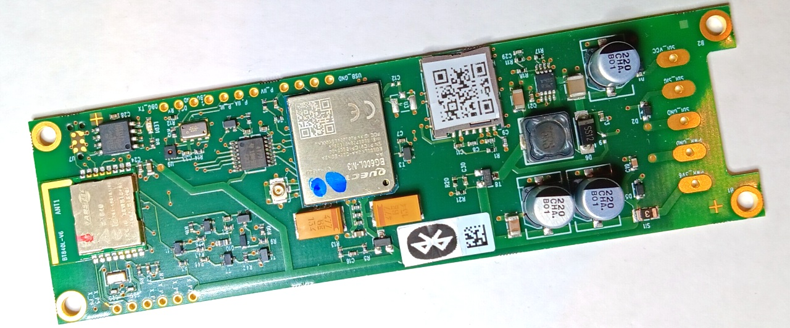

# 📁 JesFs Integration - Guide Based on an nRF52 Project "LTX Logger"

## 🎯 Overview

**JesFs** (Jo's Embedded Serial File System) is a robust, power-efficient file system for IoT devices, specifically designed for ultra-low-power applications. It is used in this project for all nRF52-based loggers.



*LTX Type1500 - An example logger with BLE, LTE-M/-NB and SDI-12 sensor bus*


> [!TIP]
> ### 🔄 Rotating History Storage
The loggers typically work with a rotating history storage consisting of 2 files, similar to the Black-Box demo in the JesFs documentation. When one file reaches its size limit, it becomes the backup file and a new one is created. This ensures a **latest history is always available** with a defined maximum time depth.

> [!NOTE]
> ### 🌐 Mirrored File System (Cloud Twin)
> A special feature: Files can be "mirrored" to a server when needed (e.g., via mobile internet). This means the file system exists in two places simultaneously, and is synchronized with each internet communication:
> - 📤 Data and parameter settings from "on-site" **to the server**
> - 📥 Remote commands and firmware updates **from the server**

> [!NOTE]
> ### 🔄 Firmware Updates Over-The-Air (OTA)
> JesFs supports secure firmware updates via various channels (BLE, Mobile Internet, LoRa, etc.). With the **JesFsBoot Secure Bootloader**, updates can be encrypted (AES-128), transmitted, and validated.

> [!IMPORTANT]
> ### 🤝 Collaboration Offer
> This documentation is the (internally used) system documentation for the LTX loggers.
> While the embedded software of the LTX project is not freely available, inquiries about **loggers, sensors, or collaboration** are warmly welcome at any time 📧!


### 💻 Hardware Platform

nRF52 refers to ARM Cortex CPUs with Bluetooth and 64 MHz:
- **NORDIC nRF52832** (512kB Flash, 64kB RAM) 
- **NORDIC nRF52840** (1024kB Flash, 256kB RAM)
- Uses **Nordic SDK 17.1.0**

 
For JesFs, an external NOR flash is available via SPI.
Type and size are managed by JesFs. What's important is that the flash
can handle the available voltage (most are usable from 1.6V - 3.3V)
and the maximum SPI frequency used (typically 8 MHz, see source codes).

### ⚡ Important Features of JesFS

- 🔋 **Power-efficient**: Deep Sleep with <0.5µA (with MX25Rxxxx Flash)
- 🛡️ **Robust**: No data loss during power failure
- 📦 **Compact**: Only 200 bytes RAM minimum required
- ⚡ **Fast**: Deep Sleep to Ready in microseconds
- 🎯 **Simple API**: Similar to standard C file functions
- ✅ **CRC32 Checking**: Optional for data integrity (ISO 3309)
- 🔓 **Unclosed Files**: Supports continued writing after power failure
- 🔄 **Firmware OTA**: Ideal also for (secure) firmware updates

---

## 🔧 Hardware Requirements

### 💾 Supported Flash ICs

Tested with the following Serial Flash ICs via SPI:

- **Macronix MX25Rxxxx** series (Ultra-Low-Power) - recommended
- **GigaDevices GD25WDxx** series (e.g., GD25WD80C)
- **GigaDevices GD25WQxx** series (e.g., GD25WQ64E)

### 📊 Typical Flash Sizes

- **MX25R8035F**: 1 MByte (recommended for smaller loggers)
- **MX25R6435F**: 8 MByte (for extensive data loggers)
- JesFs itself supports 8 kByte to 16 MByte (optionally up to 2 GByte)

### 🎛️ nRF52 Platforms

- **nRF52832** (used in the projects)
- **nRF52840** (used in the projects)

---

## 📚 Required Files from `../JesFs/`

### 📌 Core Files (always required)

| File | Description |
|------|-------------|
| `jesfs.h` | Main header with API definitions |
| `jesfs_int.h` | Internal definitions (e.g., `fs_date()`) |
| `tb_tools.h` | Tool header for platform integration |

### ⚙️ Implementation Files

| File | Usage |
|------|-------|
| `jesfs_hl.c` | High-level functions (always include) |
| `jesfs_ml.c` | Mid-level functions (for LTXLogger) |
| `platform_nRF52/JesFs_ll_pca100xx.c` | Low-level SPI driver for nRF52 |
| `platform_nRF52/tb_tools_nrf52.c` | Platform tools for nRF52 |

---

## 🔨 Integration in SEGGER Embedded Studio (SES)

Works, of course, similar with other IDEs too.

### 1️⃣ Add Files to Project

Include the JesFs files in the `.emProject` file:

> [!TIP]
> The cloned JesFs repository is located in a directory parallel to the project

```xml
<!-- Example from LTX_ble_nrf52832_s112.emProject -->
<folder Name="JesFs">
  <file file_name="../../../../../JesFs/jesfs_hl.c" />
  <file file_name="../../../../../JesFs/jesfs_ml.c" />
  <file file_name="../../../../../JesFs/platform_nRF52/JesFs_ll_pca100xx.c" />
  <file file_name="../../../../../JesFs/platform_nRF52/tb_tools_nrf52.c" />
</folder>
```

### 2️⃣ Set Include Paths

In Project Options under `c_user_include_directories`, add the JesFs path:

```
../../../../../JesFs
```

**Complete Example** (Include paths for nRF52832):

> [!NOTE]
> `SDK_ROOT` is the root directory of the Nordic SDK (here version 17.1.0)

```
...;$(SDK_ROOT)/modules/nrfx/mdk;../../../../../JesFs;...
```

### 3️⃣ Post-Build Command (optional)

> [!TIP]
> The (optional) tool `JesFsHex2Bin.exe` creates a binary file, e.g., for OTA updates.

```xml
post_build_command="../../../../Tools/JesFsHex2Bin.exe $(OutDir)/$(ProjectName).hex -h -o_firmware.bin"
```


---

## ⚙️ Initial Configuration

### 1️⃣ Define Flash Type

In a header file or in the project defines:

```c
// In jesfs.h, the following chips are already **predefined**:
#define MACRONIX_MANU_TYP_RX    0xC228  // MX25R series
#define GIGADEV_MANU_TYP_WD     0xC864  // GD25WD series
#define GIGADEV_MANU_TYP_WQ     0xC865  // GD25WQ series
```

### 2️⃣ Enable Optional Features

```c
// Enable statistics (recommended for development)
#define JSTAT

// Transfer limits (only needed if memory issues)
// #define SF_RD_TRANSFER_LIMIT 64
// #define SF_TX_TRANSFER_LIMIT 64
```

---

## 💡 Usage in the Application

> [!TIP]
> Here comes the really exciting part! Writing and reading files.

### 1️⃣ Include Headers

```c
#include "jesfs.h"     // JesFs Filesystem
#include "jesfs_int.h" // Internal functions (e.g., fs_date())
#include "tb_tools.h"  // Tools
```

### 2️⃣ Initialize File System

> [!IMPORTANT]
> JesFs has a routine for checking the system voltage as a callback (e.g., called in `fs_start()`). Typically, you know approximately how long the system capacities can maintain voltage and how long writing takes.

```c
int16_t res;

// Start file system
res = fs_start(FS_START_NORMAL);
if (res) {
    // Error: e.g., flash not formatted
    if (res == -108) {  // MAGIC not found
        printf("Formatting flash...\n");
        fs_format(FS_FORMAT_SOFT);
        res = fs_start(FS_START_NORMAL);
    }
    if (res) {
        printf("ERROR: fs_start: %d\n", res);
        // Handle critical error
    }
}
```

**Start Modes**:

- `FS_START_NORMAL`: Complete check (~20ms per MB)
- `FS_START_FAST`: Faster check (~10ms per MB)
- `FS_START_RESTART`: Very fast (~50µs) if flash already known

---

### 3️⃣ Open File

```c
FS_DESC file_desc;
int16_t res;

// Open file for reading
res = fs_open(&file_desc, "data.edt", SF_OPEN_READ);
if (res == 0) {
    // File opened successfully
    printf("File size: %lu Bytes\n", file_desc.file_len);
}

// Create file for writing (overwrites existing)
res = fs_open(&file_desc, "config.txt", SF_OPEN_CREATE | SF_OPEN_WRITE);

// File in RAW mode (Read + Write, don't close)
res = fs_open(&file_desc, "logfile.txt", SF_OPEN_CREATE | SF_OPEN_RAW);

// With CRC32 check and sync flag
res = fs_open(&file_desc, "params.cfg", 
              SF_OPEN_CREATE | SF_OPEN_WRITE | SF_OPEN_CRC | SF_OPEN_EXT_SYNC);
```

**Open Flags**:

- `SF_OPEN_READ`: Read only
- `SF_OPEN_WRITE`: Open for writing
- `SF_OPEN_CREATE`: Create file (overwrites existing!)
- `SF_OPEN_RAW`: For unclosed files (Read + Write)
- `SF_OPEN_CRC`: Calculate CRC32 checksum
- `SF_OPEN_EXT_SYNC`: Marks file for external synchronization

---

### 4️⃣ Read Data

```c
uint8_t buffer[256];
int32_t bytes_read;

// Read N bytes
bytes_read = fs_read(&file_desc, buffer, sizeof(buffer));
if (bytes_read > 0) {
    printf("Read: %ld Bytes\n", bytes_read);
}

// Read entire file (for RAW mode: set position to end of file)
fs_read(&file_desc, NULL, 0xFFFFFFFF);
```

**Return Values**:

- `> 0`: Number of bytes read
- `0`: End of file reached
- `< 0`: Error code

---

### 5️⃣ Write Data

```c
char data[] = "Measurement: 23.5°C\n";
int16_t res;

res = fs_write(&file_desc, (uint8_t*)data, strlen(data));
if (res) {
    printf("ERROR writing: %d\n", res);
}
```

**Typical Example - Append to Log File**:

```c
// Open or create RAW file
if (fs_open(&file_desc, "logfile.txt", SF_OPEN_CREATE | SF_OPEN_RAW) == 0) {
    // Position at end of file
    fs_read(&file_desc, NULL, 0xFFFFFFFF);
    
    // Append data
    char log_entry[80];
    int len = sprintf(log_entry, "[%lu] Temperature: %.1f\n", timestamp, temp);
    fs_write(&file_desc, (uint8_t*)log_entry, len);
}
```

---

### 6️⃣ Close File

```c
int16_t res;

res = fs_close(&file_desc);
if (res) {
    printf("ERROR closing: %d\n", res);
}
```

> [!IMPORTANT]
> **Important when closing**:
> - Files should be closed **to finalize CRC32**
> - RAW files **do not need to be closed** (important for `unclosed files`), then additional content can be appended to this file at any time (e.g., for data logging). The only important thing is that `0xFF` is never written. Then the end of the file can be found even after reset. See 'Unclosed Files' below
> - After `fs_close()`, the descriptor is invalid

---

### 7️⃣ Delete File

```c
FS_DESC file_desc;
int16_t res;

// Open and delete file
res = fs_open(&file_desc, "old_data.edt", SF_OPEN_READ);
if (res == 0) {
    res = fs_delete(&file_desc);
    if (res) {
        printf("ERROR deleting: %d\n", res);
    }
}
```

---

### 8️⃣ Rename File

```c
FS_DESC old_desc, new_desc;
int16_t res;

// Open old file for reading
res = fs_open(&old_desc, "data.edt", SF_OPEN_READ);
if (res == 0) {
    // Create new file (must be empty!)
    res = fs_open(&new_desc, "data.edt.old", SF_OPEN_CREATE);
    if (res == 0) {
        // Rename
        res = fs_rename(&old_desc, &new_desc);
        if (res) {
            printf("ERROR renaming: %d\n", res);
        }
    }
}
```

---

### 9️⃣ Get File List

```c
FS_STAT file_stat;
int16_t res;
uint16_t idx = 0;

printf("Files on flash:\n");
while (1) {
    res = fs_info(&file_stat, idx);
    if (res < 0) break;  // Error or end
    
    if (res & FS_STAT_ACTIVE) {
        printf("  [%d] %s - %lu Bytes", idx, file_stat.fname, file_stat.file_len);
        
        if (res & FS_STAT_UNCLOSED) {
            printf(" (unclosed)");
        }
        
        if (file_stat.file_crc32 != 0xFFFFFFFF) {
            printf(" - CRC32: 0x%08lX", file_stat.file_crc32);
        }
        printf("\n");
    }
    idx++;
}
```

---

### 🔟 Deep Sleep for Power Saving

```c
// Put flash into deep sleep (saves power)
fs_deepsleep();

// System sleeps...

// Wake up flash
res = fs_start(FS_START_RESTART);
if (res) {
    printf("ERROR waking up: %d\n", res);
}
```

**Power Consumption**:
- Normal: ~0.05-5 mA (depending on flash)
- Deep Sleep: <0.5 µA (with MX25Rxxxx)

---

## 🚀 Advanced Features

### 1️⃣ Unclosed Files (RAW Mode)

> [!TIP]
> ### ⚡ A Unique Feature of JesFs
> Files can be continued after power failure! This is ideal for data loggers that must not lose data even during power outages.

```c
FS_DESC data_desc;

// Check if file exists
if (fs_open(&data_desc, "data.edt", SF_OPEN_READ)) {
    // File doesn't exist - create new
    fs_open(&data_desc, "data.edt", SF_OPEN_CREATE | SF_OPEN_RAW);
} else {
    // File exists - open RAW and continue
    fs_open(&data_desc, "data.edt", SF_OPEN_RAW);
    fs_read(&data_desc, NULL, 0xFFFFFFFF);  // Jump to end
}

// Now can write
fs_write(&data_desc, data, len);

// RAW files are NOT closed!
```

---

### 2️⃣ CRC32 Validation

```c
FS_DESC file_desc;
uint32_t crc_calculated;

// Open file with CRC and write
fs_open(&file_desc, "sensor.dat", SF_OPEN_CREATE | SF_OPEN_WRITE | SF_OPEN_CRC);
fs_write(&file_desc, data, data_len);
fs_close(&file_desc);  // CRC is saved when closing

// Read file and check CRC
fs_open(&file_desc, "sensor.dat", SF_OPEN_READ | SF_OPEN_CRC);
fs_read(&file_desc, buffer, buffer_size);
crc_calculated = fs_get_crc32(&file_desc);

// Read CRC from file statistics
FS_STAT stat;
fs_info(&stat, 0);
if (stat.file_crc32 == crc_calculated) {
    printf("CRC OK!\n");
} else {
    printf("CRC ERROR!\n");
}
```

---

### 3️⃣ Date/Time Functions

> [!NOTE]
> JesFs uses an unsigned UNIX timestamp, which goes up to approximately year 2100 😉

```c
#include "jesfs_int.h"  // For time functions

// Set current time (Unix timestamp)
fs_set_static_secs(1735689600);  // e.g., 1.1.2025

// Convert date to seconds
FS_DATE date = {0, 0, 12, 13, 2, 2026};  // 13.2.2026 12:00:00
uint32_t timestamp = fs_date2sec1970(&date);

// Convert seconds to date
FS_DATE result_date;
fs_sec1970_to_date(timestamp, &result_date);
printf("Date: %02d.%02d.%04d %02d:%02d:%02d\n",
       result_date.d, result_date.m, result_date.a,
       result_date.h, result_date.min, result_date.sec);
```

---

### 4️⃣ File System Check

```c
extern SFLASH_INFO sflash_info;  // Global flash info

// Available space
printf("Available: %lu / %lu Bytes\n",
       sflash_info.available_disk_size,
       sflash_info.total_flash_size);

// Files
printf("Active files: %u\n", sflash_info.files_active);
printf("Deleted: %u\n", sflash_info.files_used - sflash_info.files_active);

#ifdef JSTAT
// Extended statistics
printf("Sectors to delete: %u\n", sflash_info.sectors_todelete);
printf("Free sectors: %u\n", sflash_info.sectors_clear);
#endif
```

---

### 5️⃣ Error Handling and Recovery

```c
// Test file system
int16_t res = fs_start(FS_START_NORMAL);

switch (res) {
    case 0:
        printf("File system OK\n");
        break;
        
    case -108:  // Unformatted
        printf("Formatting flash...\n");
        fs_format(FS_FORMAT_SOFT);
        fs_start(FS_START_NORMAL);
        break;
        
    case -107:  // Structure problems
    case -114:  // Index corrupt
    case -122:  // Sector list illegal
        printf("File system error - recovery needed!\n");
        // In this case: fs_format() and restart
        break;
        
    case -147:  // Voltage too low
        printf("WARNING: Battery low!\n");
        break;
        
    default:
        printf("Error %d - see jesfs.h\n", res);
}
```

---

## ⚠️ Important Error Codes

| Code | Meaning | Solution |
|------|---------|----------|
| -100 | SPI init error | Check hardware |
| -101 | Flash timeout | Check flash connection |
| -107 | FS structure faulty | Execute `fs_format()` |
| -108 | Unformatted flash | Execute `fs_format()` |
| -113 | Flash full | Delete files |
| -114 | Index corrupt | Recovery with `fs_format()` |
| -124 | File not found | Check with `fs_notexists()` |
| -141 | Flash in deep sleep | `fs_start(FS_START_RESTART)` |
| -147 | Voltage too low | Charge/replace battery |

Complete list in [jesfs.h](https://github.com/joembedded/JesFs/blob/master/jesfs.h) 

---

## 📝 Practical Examples from This Project

### 📋 Example 1: Save Parameter File

```c
// From internet.c - Save parameters
int16_t save_parameters(void) {
    FS_DESC param_desc;
    char buffer[256];
    int16_t res, len;
    
    res = fs_open(&param_desc, "iparam.lxp", 
                  SF_OPEN_WRITE | SF_OPEN_CREATE | SF_OPEN_CRC | SF_OPEN_EXT_SYNC);
    if (res) return res;
    
    // Write parameter lines
    len = sprintf(buffer, "VERSION=%d\n", PARAM_VERSION);
    res = fs_write(&param_desc, buffer, len);
    
    len = sprintf(buffer, "SERVER=%s\n", server.address);
    res = fs_write(&param_desc, buffer, len);
    
    // More parameters...
    
    return fs_close(&param_desc);
}
```

### 📊 Example 2: Measurement Data Logger (Unclosed File)

```c
// From measure.c - Append measurement data
FS_DESC meas_desc;

void init_datalog(void) {
    // Check if file exists
    if (fs_open(&meas_desc, "data.edt", SF_OPEN_READ)) {
        // Create new
        fs_open(&meas_desc, "data.edt", 
                SF_OPEN_CREATE | SF_OPEN_RAW | SF_OPEN_EXT_SYNC);
    } else {
        // Continue after power failure
        fs_open(&meas_desc, "data.edt", 
                SF_OPEN_RAW | SF_OPEN_EXT_SYNC);
        fs_read(&meas_desc, NULL, 0xFFFFFFFF);  // To end
    }
}

void log_measurement(float temperature, float humidity) {
    char line[80];
    int len = sprintf(line, "%lu;%.2f;%.2f\n", 
                     get_timestamp(), temperature, humidity);
    
    int16_t res = fs_write(&meas_desc, (uint8_t*)line, len);
    if (res) {
        printf("Log error: %d\n", res);
    }
}
```

### 🔄 Example 3: Log File with Rotation

```c
// From logfiles.c - Rotate log file
#define MAX_LOG_HISTORY 102400  // 100 kB

void write_log_with_rotation(char *message) {
    FS_DESC log_desc, old_desc;
    
    // Open log file
    if (fs_notexists("logfile.txt")) {
        fs_open(&log_desc, "logfile.txt", SF_OPEN_CREATE | SF_OPEN_RAW);
    } else {
        fs_open(&log_desc, "logfile.txt", SF_OPEN_RAW);
        fs_read(&log_desc, NULL, 0xFFFFFFFF);
    }
    
    // Write
    fs_write(&log_desc, (uint8_t*)message, strlen(message));
    
    // Rotation if too large
    if (log_desc.file_len >= MAX_LOG_HISTORY) {
        printf("Log file rotation...\n");
        
        // Delete old version if present
        if (!fs_open(&old_desc, "logfile.txt.old", SF_OPEN_READ)) {
            fs_delete(&old_desc);
        }
        
        // Move current log to .old
        fs_open(&log_desc, "logfile.txt", SF_OPEN_READ);
        fs_open(&old_desc, "logfile.txt.old", SF_OPEN_CREATE);
        fs_rename(&log_desc, &old_desc);
        
        // Start fresh
        fs_open(&log_desc, "logfile.txt", SF_OPEN_CREATE | SF_OPEN_RAW);
    }
}
```

---

## ⚡ Performance Tips

### 1️⃣ Optimize Start Mode

```c
// First start after power-on
fs_start(FS_START_NORMAL);

// Later accesses (flash info known)
fs_start(FS_START_FAST | FS_START_RESTART);
```

### 2️⃣ Use Deep Sleep

```c
// Put flash to sleep after operations
fs_deepsleep();

// Wake up before next access
fs_start(FS_START_RESTART);
```

### 3️⃣ Bundle Write Accesses

```c
// BAD: Many small writes
for (int i = 0; i < 100; i++) {
    fs_write(&desc, &data[i], 1);
}

// GOOD: Bundled writing
fs_write(&desc, data, 100);
```

---

## ⚠️ Known Limitations

> [!WARNING]
> The following limitations should be noted:
> 1. **No directory tree**: Flat file system (max. ~1000 files with 4k sectors)
> 2. **File names**: Max. 21 characters (FNAMELEN)
> 3. **No POSIX**: Not POSIX compliant (but similar API)
> 4. **Sector size**: Flash must support 4096-byte sectors
> 5. **Single-threaded**: No simultaneous access from multiple threads without mutex

---

## 🔗 Further Resources

- 📦 **JesFs Repository**: [github.com/joembedded/JesFs](https://github.com/joembedded/JesFs)
- 📖 **Detailed Documentation**: `../JesFs/README.md`
- 🎯 **Example Project**: `../JesFs/usecase_BlackBox/`
- 🔧 **Platform Info**: `../JesFs/platform_nRF52/ReadMe.txt`

---

## 📋 Summary - Quick Reference

```c
// Init
fs_start(FS_START_NORMAL);
fs_format(FS_FORMAT_SOFT);  // If needed

// File operations
FS_DESC desc;
fs_open(&desc, "file.txt", SF_OPEN_READ);
fs_read(&desc, buffer, size);
fs_write(&desc, data, len);
fs_close(&desc);
fs_delete(&desc);
fs_rename(&old_desc, &new_desc);

// Info
FS_STAT stat;
fs_info(&stat, index);
fs_notexists("file.txt");

// Power
fs_deepsleep();
fs_start(FS_START_RESTART);

// Global info
extern SFLASH_INFO sflash_info;
```

---

> [!NOTE]
> ### 📄 Documentation Info
> - **Date**: February 13, 2026  
> - **Based on**: JesFs by joembedded@gmail.com  
> - **License**: MIT License
> - **Project**: LTX Logger System
>
> 💬 **Questions or feedback?** Always welcome!

***
