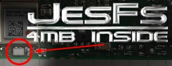
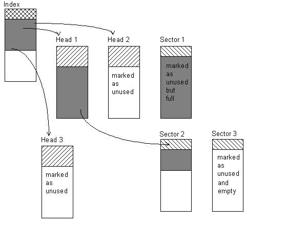
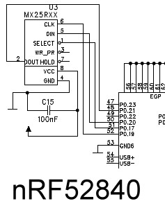
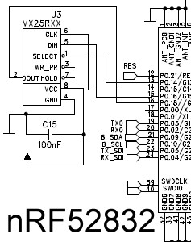
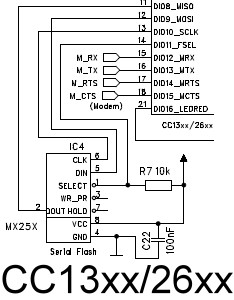
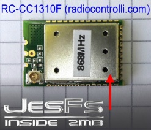
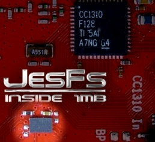
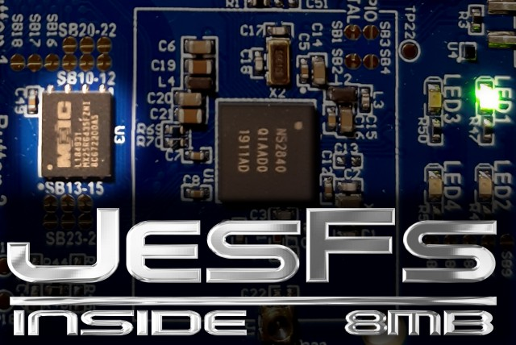
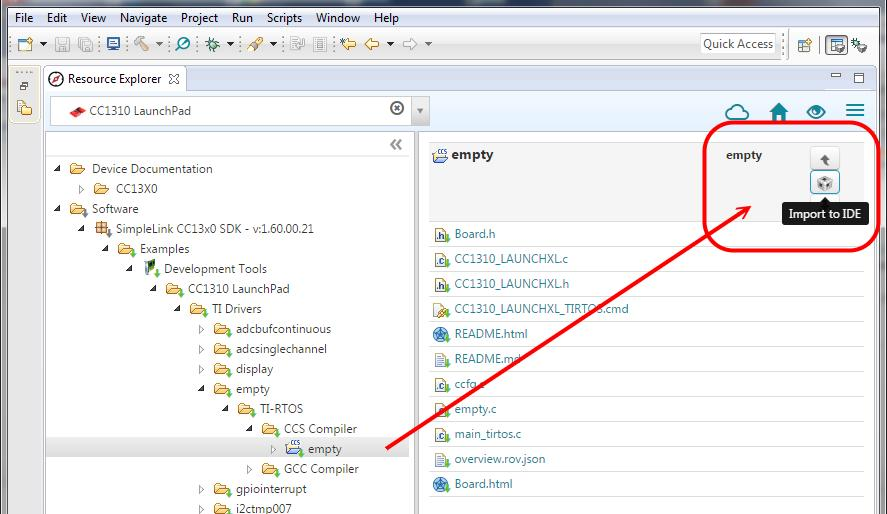

# 

> *"I have detailed Files"* – The T800, Terminator II  


# JesFs – Jo's Embedded Serial File System

## **The File System for real IoT** 🚀

Welcome to **JesFs** – a file system that's currently running on **thousands of IoT devices worldwide**, from mountain peaks to industrial floors, keeping data safe and devices smart since its first deployment!

  
*[Yes, that's 4MB of file system power on a 2x3 mm chip!]*

---

## Why JesFs? The Story Behind It

Picture this: You're standing in 3000 meters altitude, -20°C, digging holes in the snow to access your IoT device. Not fun, right? That's exactly why JesFs was born.

My daily work is the IoT, and I needed a file system that could:
- **Survive power losses** without breaking a sweat
- Run on **ultra-small devices** with minimal resources  
- Work **reliably for years** without maintenance
- Handle **firmware updates and paramater changes remotely** and securely
- Be easily **mirrored to a digital twin 👯‍♂️ in the Cloud**
  (As used e.g. in the [LTX project](https://github.com/joembedded/LTX_server))

And I couldn't find one. So I built it! 🛠️

**JesFs** is designed for **"Small and Ultra-Low-Power IoT Devices"** that need to communicate over many different channels (WiFi, Mobile Internet, Bluetooth, UART, Radio-Link, LoRa, Satellite, ...) and must work reliably for years.

---

## What Makes JesFs Special?

### 🎯 Field-Proven & Production-Ready
- **Used on thousands of IoT devices** worldwide
- **Several years** of real-world experience
- Proven in **professional, scientific, and hobbyist** applications
- **MIT License** – completely open source and free

### 💪 Incredibly Small Footprint
- Works on MCUs with only **8kByte program memory** (yes, really!)
- Requires only **200 Bytes of RAM** minimum
- Supports devices from tiny **16-Bit** to powerful **ARM** cores
- Perfect for battery-powered devices

### ⚡ Blazing Fast Performance
- **Reading:** 0.5 - 3.75 MB/sec (depending on SPI speed & CRC usage)
- **Silent reading:** ~100 MB/sec (for finding file ends)
- **Writing:** 30-70 kB/sec
- **Deep Sleep to Ready:** Just a few microseconds!
- **Power consumption in Deep Sleep:** <0.5µA (with MX25Rxxxx chips)

### 🛡️ Robust & Secure
- **No data loss** on power failure or reset
- **CRC32 integrity checking** (ISO 3309 standard)
- Works with the **JesFsBoot secure bootloader**
- **AES-128 encrypted** firmware updates possible via OTA, BLE, ...
- Optimized **wear leveling** for maximum flash lifetime

### 🎨 Developer Friendly
- **Intuitive API** – if you know `fopen()`, you know JesFs! (Note: But JesFs is not POSIX-compliant)
- **Flat file system** – no complex directory structures
- **Up to ~1000 files** on standard 4KB sector flash
- **Unclosed files support** – unique feature for IoT applications!
- Works **standalone** or with **RTOS**

### 🌍 Wide Platform Support
- **Flash sizes:** 8 kByte to 16 MByte (optionally up to 2 GByte)
- **Tested with:** Macronix MX25Rxx, GigaDevices GD25WDxx/GD25WQxx, and more
- **Platforms:** nRF52840, nRF52832, CC13xx/CC26xx, SAMD20, Windows (for development), and others

---

## Quick Start – The "I Have Detailed Files" Experience

### Installation (Examples)

#### **For Nordic nRF52 CPUs:**
```bash
# Built with SES (V6.22a) and SDK 17.1.0
# Set Macro $SDK_ROOT in SES -> Tools -> Options -> Building
# Example: "SDK_ROOT=C:\nordic\nRF5_SDK_17.1.0_ddde560"
```

#### **For TI CC13xx/CC26xx:**
- Start with TI-RTOS "empty" project via Resource Explorer
- Add JesFs files to your project
- Add **CC13XX_CC26XX** as Preprocessor Definition
- Done! ✨

#### **For Windows Development:**
- Use the included Windows demo project
- Perfect for testing and development before deployment

---

## The API – Simple & Powerful

```c
// Core Functions
int16_t fs_start(uint8_t mode);                  // Initialize JesFs
int16_t fs_format(uint32_t f_id);                // Format the flash
void    fs_deepsleep(void);                      // Ultra-low power mode

// File Operations  
int16_t fs_open(FS_DESC *pdesc, char* pname, uint8_t flags);
int32_t fs_read(FS_DESC *pdesc, uint8_t *pdest, uint32_t anz);
int16_t fs_write(FS_DESC *pdesc, uint8_t *pdata, uint32_t len);
int16_t fs_close(FS_DESC *pdesc);
int16_t fs_delete(FS_DESC *pdesc);
int16_t fs_rewind(FS_DESC *pdesc);
int16_t fs_rename(FS_DESC *pd_odesc, FS_DESC *pd_ndesc);

// File System Info
int16_t  fs_info(FS_STAT *pstat, uint16_t fno);
uint32_t fs_get_crc32(FS_DESC *pdesc);
int16_t  fs_check_disk(void cb_printf(char *fmt, ...), uint8_t *pline, uint32_t line_size);
void     fs_sec1970_to_date(uint32_t asecs, FS_DATE *pd);
```

*Looks familiar? That's the point! 😊*

---

## Technical Highlights

### How JesFs Works with NOR-Flash

NOR-Flash has a special characteristic: you can only write **"0"**, never directly write **"1"**. To set bits back to "1", you must **erase** entire sectors (typically 4KB blocks). This is why smart file systems are essential!



**JesFs uses a 3-level sector architecture:**
- **Index:** The master table (never erased!)
- **Head:** Where each file starts
- **Sector Pool:** The rest of your storage

### The Magic of Unclosed Files 🎩

This is something you won't find in traditional file systems! 

**The Problem:** Traditional systems must close files to update directory tables. If power fails during close → data corruption or loss!

**JesFs Solution:** Because empty flash is `0xFF`, we can always find file ends without closing! Just avoid writing `0xFF` bytes (use escape sequences or ASCII/Base64 encoding).

**Result:** Power loss? No problem! Your data is safe. ✅

### Performance Stats

Real-world measurements on nRF52840:
- Finding end of 16MB file: **<100 msec**
- Sector scan speed: **~25 µsec/sector** (CC1310)
- CRC32 calculation: Minimal CPU overhead

See [Documentation/PerformanceTests.pdf](Documentation/PerformanceTests.pdf) for detailed benchmarks!

---

## Real-World Use Cases

### 🎯 The BlackBox Demo – An IoT *Flight Recorder*

Ever wondered what went wrong when a device fails after years of reliable operation?

**JesFs BlackBox** creates an embedded flight recorder for your devices:
- Continuous event logging
- Millions of write cycles support
- Perfect for debugging field failures
- No data loss on power failures

Read more: [usecase_BlackBox/BlackBox_Eval.pdf](usecase_BlackBox/BlackBox_Eval.pdf)

### 🌐 Remote Firmware Updates possible

Think of your embedded devices updating themselves:
- Via **WiFi**, **Mobile Internet**, **Bluetooth**, **UART**, or **Radio-Link**
- **Completely secure** with AES-128 encryption
- No physical access needed!
- Works seamlessly with **JesFsBoot** secure bootloader (only 8kB!)

### 📝 Configuration & Language Files

Change device behavior without recompiling:
- Store settings, calibration data, language files
- Update graphics, sounds, or any resource
- Make changes in the field – easy!

---

## Supported Hardware

### Serial Flash Chips (Wide Voltage Range 1.6V-3.6V)
- **Macronix:** MX25R-Series (MX25Rxx)
- **GigaDevices:** GD25W-Series (GD25WD80C, GD25WQ64E, ...)
- And many more – typically any standard Serial NOR-Flash!

### Development Boards

#### **Nordic nRF52 Family:**
 

#### **TI CC13xx/CC26xx Family:**


#### **Tiny Modules:**
  

*The RC-CC1310F module from radiocontrolli.com with 2MB built-in!*

#### **Flash Chips:**
 &nbsp;&nbsp;&nbsp; 


*From 1MB to 8MB – plenty of room for your files!*

---

## Detailed Technical Documentation

### File System Structure

**JesFs is a "flat" file system** – no directories, just files. Simple and effective!

- **Up to ~1000 files** (on 4KB sector flash)
- **Filenames:** Up to 21 characters, almost any character allowed
- Examples of *valid* names: `*$abc/hello\world&.bin$*`, `sensor_data.log`, `fw_v2.3.1.bin`

### Memory Requirements

**Minimal RAM usage:**
- **File Descriptor:** ~28 Bytes per open file
- **Stat Descriptor:** ~30 Bytes for directory scanning
- **SF_INFO structure:** 164-256 Bytes (static flash info)
- **Total minimum:** ~200 Bytes!

### Code Architecture

JesFs is modular and portable:
- **Low-level drivers:** `JesFs_ll_xxxxx.c` (platform-specific)
  - `JesFs_ll_pca100xx.c` for nRF52
  - `JesFs_ll_tirtos.c` for CC13xx/CC26xx
  - `JesFs_ll_pc.c` for Windows
- **Mid-level:** `jesfs_ml.c` (flash management, hardware-independent)
- **High-level:** `jesfs_hl.c` (file API, hardware-independent)
- **Header:** `jesfs.h` (your main interface)
- **Tools:** `tb_tools_xxx.c` (UART, Clock, LEDs, etc.)

### External File Sync

Special flag `SF_OPEN_EXT_SYNC` marks files for automatic synchronization to external servers. There's even a PHP framework for mapping JesFs files to web servers!

Visit [joembedded.de](https://joembedded.de/) for more details.

---

## Demos & Getting Started

### 1️⃣ Nordic nRF52840 DK (PCA10056) Demo

The nRF52840 DK comes with a massive **8 MB Serial Flash** – perfect for JesFs!

**Setup:**
1. Copy demo to your SDK directory
2. Example path: `C:/nordic/nRF5_SDK_16.0.0_98a08e2/own_projects/test/JesFsDemo/`
3. Open with SEGGER Embedded Studio
4. Compile and run!
5. Connect via virtual COM-Port (115200 8N1)

**Project location:** use the SES projects in:
- `platform_nRF52/nrf52832/ses/`
- `platform_nRF52/nrf52840/ses/`

### 2️⃣ TI CC1310/CC1350 Launchpad Demo

Works with most CC13xx/CC26xx family chips!

**Setup:**


**Step 1:** Select your Launchpad in Resource Explorer



**Step 2:** Import "empty" project


**Step 3:** Delete `empty.c` and add all JesFs files


**Step 4:** Add `CC13XX_CC26XX` as Preprocessor Definition  
(Project Options -> Preprocessor Definitions)

**Step 5:** Start Terminal and test!

**Demo commands:**
```
> O test.dat        // Open "test.dat" for writing
> W 5               // Write 5 test blocks
> c                 // Close file
> v                 // View directory (show files)
```

**Tips:** 
- The XDS110 emulator's COM port can be unreliable
- Consider using a separate FTDI 3.3V TTL-UART cable

### 3️⃣ Windows Development Demo

Perfect for developing and testing on your PC!

**Features:**
- Uses `JesFs_ll_pc.c` driver (simulates flash in RAM)
- Read/write **binary flash images**
- Hex dump command: `m HEXADDR`
- Great for algorithm development before deployment

**Flash image example:**


*(Magic value "4A 65 73 46" = "JesF", followed by Flash ID and format timestamp)*

---

## The Secure Bootloader – JesFsBoot

JesFs plays perfectly with **JesFsBoot**, a secure bootloader for ARM Cortex-M cores!

### Features:
- **Tiny footprint:** Only 8kB on CC13xx/CC26xx
- **Reads JesFs directly** – no intermediate buffers needed
- **AES-128-CBC encryption** – firmware is cryptographically secure
- **No external modification possible** – keys stay inside the CPU
- **Written in C** – easier and more flexible than scripts

### How It Works:
1. Firmware file stored in JesFs (encrypted)
2. Bootloader reads and decrypts on-the-fly
3. Programs the application flash
4. Boots into new firmware
5. All secure and automatic! 🔒

*Note: Bootloader is optional – JesFs works perfectly standalone too!*
Documentation for JesFsBoot: 📧 Just drop me a note!

---

## Version History

### Latest: V2.72
- JesFs_hl.c (File V1.92)
- All global fs_* functions check supply voltage on entry
- Added feature: supply voltage check

### Recent Updates:
- **V2.61:** Atmel SAMD20 support (community contributed – kudos!)
- **V2.60:** Global Macro $SDK_ROOT for flexible paths
- **V2.55:** SDK 17.1.0 and SES 5.42a support
- **V2.30:** Added Flash ID printing for analysis
- **V2.10:** nRF52832 support
- **V2.0:** Enhanced UART driver for multi-use
- **V1.6:** Added careful disk check function
- **V1.5:** nRF52840 port with Deep Sleep support (<3µA!)
- **V1.0:** Initial release for CC13xx/CC26xx and Windows

*Full changelog in source files*

---

## FAQ & Pro Tips

### Q: What if I accidentally write 0xFF?
**A:** Use escape sequences (0xFE 0x01 for 0xFF) or use ASCII/Base64 encoding for your data!

### Q: Can I use JesFs on internal CPU flash?
**A:** Yes! JesFs works with any NOR-flash, internal or external. Only check if single byte writes are possible.

### Q: How many write cycles can I expect?
**A:** Typically 1,000 to 1,000,000 erases per sector (check your flash datasheet). JesFs's wear leveling maximizes lifetime.

### Q: Do I need an RTOS?
**A:** Nope! JesFs works standalone, but can leverage RTOS benefits if available.

### Q: How do I handle multiple simultaneous writes?
**A:** You can have as many files open as RAM allows, but only one write instance per file (which makes sense, right?).

---

## Community & Support

### Resources:
- 🌐 **Homepage:** [joembedded.de](https://joembedded.de/)
- 📄 **Detailed API Docs:** [jesfs.h](jesfs.h) and inline source comments
- 📊 **Performance Tests:** [Documentation/PerformanceTests.pdf](Documentation/PerformanceTests.pdf)
- 🎯 **Use Case - BlackBox:** [usecase_BlackBox/readme.md](usecase_BlackBox/readme.md)
- 🚀 **LTX project** [LTX project](https://github.com/joembedded/LTX_server)

### License:
**MIT License** – Use it freely in commercial, scientific, or hobbyist projects!

### Get Involved:
JesFs is actively maintained and used in thousands of devices. Found a bug? Have a feature idea? Contributions welcome!

---

## Final Words

Whether you're building a weather station at 3000m altitude, a smart home device, an industrial sensor, or just tinkering with IoT – **JesFs has got your back**!

**Thank you for your interest in JesFs!**

*– Jo*

---

### Quick Reference Card

| Feature | Specification |
|---------|---------------|
| **Min. RAM** | ~200 Bytes |
| **Min. Code Size** | ~8kB (with bootloader) |
| **Flash Support** | 8kB - 16MB (opt. 2GB) |
| **Max Files** | ~1000 (4KB sectors) |
| **Filename Length** | 21 characters |
| **Read Speed** | 0.5 - 3.75 MB/s |
| **Write Speed** | 30 - 70 kB/s |
| **Deep Sleep Current** | <0.5µA |
| **Wakeup Time** | Few µsec |
| **CRC Support** | CRC32 (ISO 3309) |
| **Platforms** | nRF52, CC13xx/26xx, SAMD20, MSP430, Windows, ... |
| **License** | MIT |
| **Status** | Production-ready, thousands of deployments |

---

