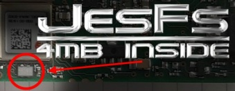
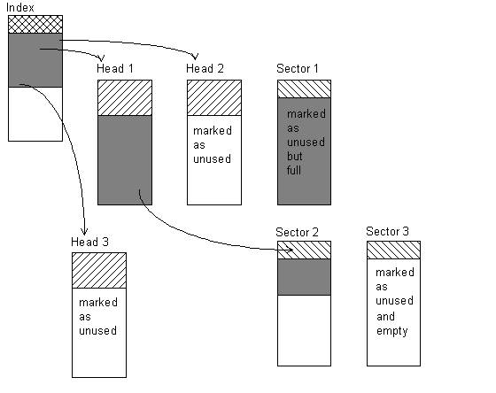
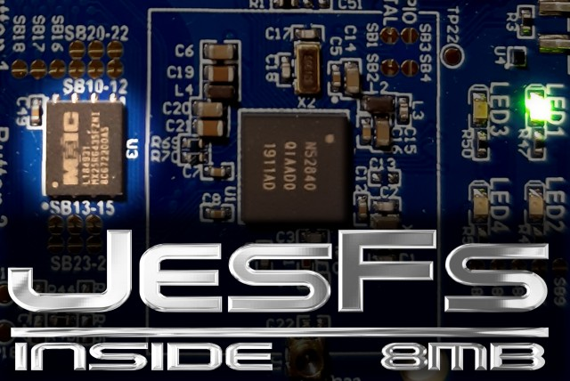
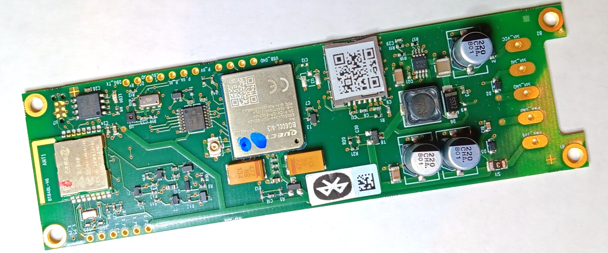

# 

> _"I have detailed Files."_ - A literary nod to the T800 in Terminator II.

# JesFs - Jo's Embedded Serial File System

## The File System for real IoT

JesFs is a small, robust file system for NOR flash in embedded and low-power IoT devices. It was built for systems that must survive resets, power loss, remote updates, long field deployments, and years of unattended operation.

It is already used on thousands of devices, from mountain stations to industrial loggers. The original deployments were bare-metal. The current direction is clear: **bare-metal nRF52 remains useful, but Zephyr RTOS is the future-facing platform path.**

  
_4 MB of file system power on a 2 x 3 mm flash chip._

---

## Why JesFs Exists

If an IoT device fails in the field, the next question is simple: what happened before it died?

JesFs was written for exactly that class of devices:

- Data loggers that must keep their last records after power loss.
- Devices that receive parameters, resources, or firmware remotely.
- Small systems where a POSIX file system is too large or too generic.
- Products that mirror selected files to a server-side digital twin.
- Battery-powered hardware where wakeup time and sleep current matter.

JesFs is intentionally **not POSIX-compliant**. It is a flat, deterministic embedded file system for NOR flash. No directories, no desktop abstraction, no unnecessary operating-system baggage.

---

## What Makes JesFs Different

### Small

- Typical minimum RAM use is about **200 bytes**.
- File descriptors are small enough for tiny MCUs.
- The core was originally designed for very small bare-metal targets.

### Robust

- Power-loss-safe design for sequential files.
- CRC32 support for closed files that must be verified.
- Files can intentionally remain unclosed, which is useful for loggers.
- Sector allocation and reuse are designed around real NOR-flash behavior.

### Fast Enough for Real Products

- Typical read speed: **0.5 to 3.75 MB/s**, depending on SPI and CRC use.
- Typical write speed: **30 to 70 kB/s**.
- Silent reads can be much faster when scanning for the end of an unclosed file.
- Deep-sleep wakeup is in the microsecond range on suitable hardware.

For measured details, see [PerformanceTests.pdf](Documentation/PerformanceTests.pdf).

### Built for IoT Workflows

- Configuration files, language files, resource files, calibration data.
- Blackbox/event logs for post-mortem analysis.
- Firmware files for OTA workflows and secure bootloaders.
- Application-level synchronization through the `SF_OPEN_EXT_SYNC` flag.

---

## Quick Start

Start here:

- [jesfs_quick.md](jesfs_quick.md) - compact JesFs quickstart with Zephyr and bare-metal API examples.
- [platform_Zephyr_RTOS/docu_jesfs_zephyr/readme.md](platform_Zephyr_RTOS/docu_jesfs_zephyr/readme.md) - Zephyr-specific setup notes, build configuration, shell commands, and SPI NOR hints.
- [Documentation/Use_JesFs_en.md](Documentation/Use_JesFs_en.md) - real-world integration guide based on the LTX logger project.

For the public API, use [jesfs.h](jesfs.h) as the source of truth. It contains the current version history, error codes, flags, and data structures.

---

## API Snapshot

The application-facing API is deliberately small:

```c
int16_t jesfs_start(uint8_t mode);
int16_t jesfs_deepsleep(void);
int16_t jesfs_format(uint8_t fmode); /* bare-metal */
int16_t jesfs_format(uint8_t fmode, void cb_prog(uint32_t cur_sect, uint32_t total_sect)); /* Zephyr */

int16_t jesfs_open(struct jesfs_desc *pdesc, const char *pname, uint8_t flags);
int32_t jesfs_read(struct jesfs_desc *pdesc, uint8_t *pdest, uint32_t len);
int16_t jesfs_write(struct jesfs_desc *pdesc, const uint8_t *pdata, uint32_t len);
int16_t jesfs_close(struct jesfs_desc *pdesc);
int16_t jesfs_delete(struct jesfs_desc *pdesc);
int16_t jesfs_rename(struct jesfs_desc *pd_odesc, struct jesfs_desc *pd_ndesc);
int16_t jesfs_info(struct jesfs_stat *pstat, uint16_t fno);
int16_t jesfs_check_disk(void cb_printf(const char *fmt, ...));
```

Older bare-metal code can still use the historic `fs_` names through compatibility macros where enabled. New Zephyr code should use the `jesfs_` names to avoid confusion with Zephyr's own `fs_` APIs.

---

## Technical Core in One Page

NOR flash can program bits from `1` to `0`, but setting bits back to `1` requires erasing a complete sector. JesFs embraces that instead of hiding it behind a large abstraction.



The layout is intentionally simple:

- **Index sector**: master table with file start-sector references.
- **HEAD sector**: one file starts here; metadata lives here.
- **DATA sectors**: linked sectors containing the payload.
- **Deleted sectors**: marked first, erased later when reused.

The special logger feature is the **unclosed file**. Empty flash reads as `0xFF`, so JesFs can scan forward and rediscover the real end of an append-style file after reset or power loss. For binary payloads in unclosed files, avoid plain `0xFF` bytes by escaping or encoding them.

More detailed behavior, flags, examples, and edge cases are documented in [jesfs_quick.md](jesfs_quick.md).

---

## Platform Direction

### Zephyr RTOS

The Zephyr port is the current forward-looking path. It uses Zephyr's flash and device model instead of custom SPI flash bit handling in the JesFs low-level layer.

Read the Zephyr notes here:

- [Zephyr documentation](platform_Zephyr_RTOS/docu_jesfs_zephyr/readme.md)
- [SFDP / `sfdp-bfp` note](platform_Zephyr_RTOS/src/jesfs/sfdp_decode.md)

### Bare-Metal nRF52

The nRF52 bare-metal demos are still relevant for small, low-power Nordic systems and for understanding the original JesFs integration style.



Project folders:

- [platform_nRF52/](platform_nRF52/)
- [Documentation/Use_JesFs_en.md](Documentation/Use_JesFs_en.md)
- [nRF52840 CPU / board image](Documentation/nrf52840.jpg)
- [nRF52832 CPU / board image](Documentation/nrf52832.jpg)
- [nRF52840 DK connection image](Documentation/Nrf52840_DK.jpg)

### Legacy Bare-Metal Platforms

Older ports for TI CC13xx/CC26xx and SAMD20 remain in the repository for reference and migration help. They are no longer the main story for new projects.

Reference folders:

- [platform_CC13XX_CC26XX/](platform_CC13XX_CC26XX/)
- [platform_SAMD20/](platform_SAMD20/)
- [platform_SAMD20/Configure_JesFs_for_SAMD20.pdf](platform_SAMD20/Configure_JesFs_for_SAMD20.pdf)

### Windows Development

The Windows platform is useful for algorithm tests, file-system experiments, and flash-image inspection before deployment.

- [platform_WIN/](platform_WIN/)

---

## Use Cases

### Embedded Blackbox

JesFs can act as a small flight recorder: event log, state changes, diagnostics, and last-known-good traces survive power loss.

- [usecase_BlackBox/readme.md](usecase_BlackBox/readme.md)
- [usecase_BlackBox/BlackBox_Eval.pdf](usecase_BlackBox/BlackBox_Eval.pdf)

### LTX Logger Integration



The LTX Type1500 integration shows JesFs in a real data logger with BLE, LTE-M/-NB, SDI-12 sensor bus, and field-update workflows.

- [How JesFs is used on LTX Type1500](Documentation/Use_JesFs_en.md)
- [LTX server project](https://github.com/joembedded/LTX_server)

### Firmware and Resource Updates

JesFs can store firmware images, settings, calibration data, graphics, language files, or other resources. Together with a bootloader, this enables remote updates through WiFi, mobile internet, Bluetooth, UART, radio links, LoRa, satellite links, or other application transports.

---

## Documentation and Media Map

### Main Documentation

- [jesfs_quick.md](jesfs_quick.md) - quickstart and API examples.
- [Documentation/Use_JesFs_en.md](Documentation/Use_JesFs_en.md) - LTX integration guide.
- [Documentation/PerformanceTests.pdf](Documentation/PerformanceTests.pdf) - performance measurements.
- [usecase_BlackBox/readme.md](usecase_BlackBox/readme.md) - BlackBox overview.
- [usecase_BlackBox/BlackBox_Eval.pdf](usecase_BlackBox/BlackBox_Eval.pdf) - BlackBox evaluation.
- [platform_Zephyr_RTOS/docu_jesfs_zephyr/readme.md](platform_Zephyr_RTOS/docu_jesfs_zephyr/readme.md) - Zephyr platform notes.
- [platform_Zephyr_RTOS/src/jesfs/sfdp_decode.md](platform_Zephyr_RTOS/src/jesfs/sfdp_decode.md) - Zephyr SFDP extraction note.
- [platform_SAMD20/Configure_JesFs_for_SAMD20.pdf](platform_SAMD20/Configure_JesFs_for_SAMD20.pdf) - legacy SAMD20 setup guide.

### Images

- [Documentation/jesfs_logo.jpg](Documentation/jesfs_logo.jpg)
- [Documentation/ltx_jesfs.jpg](Documentation/ltx_jesfs.jpg)
- [Documentation/intent1500.jpg](Documentation/intent1500.jpg)
- [Documentation/sector_layout.jpg](Documentation/sector_layout.jpg)
- [Documentation/hex_dump.png](Documentation/hex_dump.png)
- [Documentation/nrf52840.jpg](Documentation/nrf52840.jpg)
- [Documentation/nrf52832.jpg](Documentation/nrf52832.jpg)
- [Documentation/Nrf52840_DK.jpg](Documentation/Nrf52840_DK.jpg)
- [Documentation/CC13xx26xx.jpg](Documentation/CC13xx26xx.jpg)
- [Documentation/cc13xx_flash.jpg](Documentation/cc13xx_flash.jpg)
- [Documentation/rc1310_module.jpg](Documentation/rc1310_module.jpg)
- [Documentation/setup_step1.jpg](Documentation/setup_step1.jpg)
- [Documentation/setup_step1b.jpg](Documentation/setup_step1b.jpg)
- [Documentation/setup_step2.jpg](Documentation/setup_step2.jpg)
- [Documentation/setup_step3.jpg](Documentation/setup_step3.jpg)
- [platform_Zephyr_RTOS/docu_jesfs_zephyr/img/set_build_config_a.png](platform_Zephyr_RTOS/docu_jesfs_zephyr/img/set_build_config_a.png)
- [platform_Zephyr_RTOS/docu_jesfs_zephyr/img/set_build_config_b.png](platform_Zephyr_RTOS/docu_jesfs_zephyr/img/set_build_config_b.png)

---

## Version Status

Source-of-truth: [jesfs.h](jesfs.h)

- Core JesFs: **V1.94 / 21.06.2026**
- Zephyr port milestone: **V2.00 / 21.06.2026**
- License: [MIT](LICENSE)

> [!IMPORTANT]
> **Statement on AI Usage:** The source code was authored, manually entered, and reviewed by qualified human engineers. AI tools supported documentation and review work. No AI-generated source code was directly copied or integrated.

---

## Quick Reference

| Feature | Specification |
|---------|---------------|
| Minimum RAM | About 200 bytes |
| Flash type | NOR flash, internal or external |
| Typical sector size | 4 kB |
| Flash size | 8 kB to 16 MB, optionally larger |
| File model | Flat, no directories |
| Filename length | `FNAMELEN`, currently 21 characters |
| Integrity | Optional CRC32, ISO 3309 |
| Special mode | Unclosed RAW files for power-loss-safe logging |
| Current platform focus | Zephyr RTOS |
| Still useful | Bare-metal nRF52 |
| Legacy reference | CC13xx/CC26xx, SAMD20 |

JesFs is not trying to be a desktop file system. It is a small field-proven storage tool for embedded products that need detailed files, even when the power disappears at the worst possible moment.
