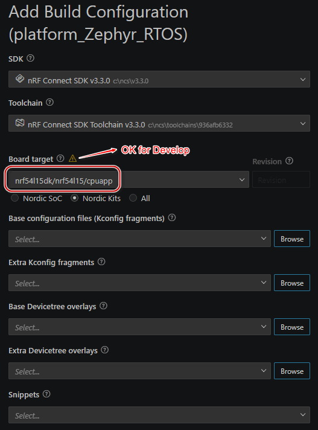
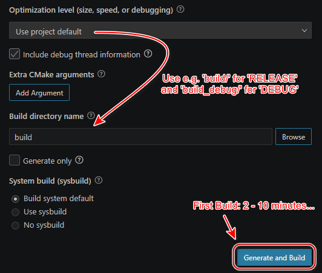

# JesFs on Zephyr RTOS

This directory contains the Zephyr-specific notes for JesFs. The main project README gives the overview; this file is the technical platform entry point for Zephyr builds.

The current Zephyr sample targets Nordic development with the nRF Connect SDK. The project was prepared with NCS v3.3.0

## What Changes in the Zephyr Port

In the older bare-metal ports, JesFs low-level code drives the flash directly: SPI transfer, wakeup, write-enable, busy polling, erase, program, and deep power-down handling.

In Zephyr, those jobs belong to the Zephyr flash driver. The JesFs low-level layer is therefore much thinner:

- `src/jesfs/jesfs_ll_zephyr.c` wraps Zephyr flash access, JEDEC ID access, and runtime PM.
- `src/jesfs/jesfs_shell.c` provides interactive test and diagnostic commands.
- `jesfs_hl.c` and `jesfs_ml.c` remain the shared JesFs core.
- `jesfs.h` remains the public API and version/error source of truth.

New Zephyr application code should use the `jesfs_` function names, for example `jesfs_open()` and `jesfs_read()`. The old `fs_` names are kept only as compatibility aliases for non-Zephyr code where enabled.

## Project Files

- [../CMakeLists.txt](../CMakeLists.txt) - Zephyr application project.
- [../Kconfig](../Kconfig) - JesFs-related Kconfig entry.
- [../prj.conf](../prj.conf) - Zephyr feature configuration.
- [../app.overlay](../app.overlay) - board overlay for UART/debug hardware.
- [../src/main.c](../src/main.c) - sample application and shell integration.
- [../src/jesfs/jesfs_ll_zephyr.c](../src/jesfs/jesfs_ll_zephyr.c) - Zephyr low-level bridge.
- [../src/jesfs/jesfs_shell.c](../src/jesfs/jesfs_shell.c) - shell command implementation.
- [../src/jesfs/sfdp_decode.md](../src/jesfs/sfdp_decode.md) - extracting `sfdp-bfp` from raw SFDP data.

## Required Zephyr Configuration

The important settings are in `prj.conf`:

```conf
CONFIG_JESFS_SHELL=y

CONFIG_FLASH=y
CONFIG_SPI=y
CONFIG_SPI_NOR=y
CONFIG_CRC=y

CONFIG_PM=y
CONFIG_PM_DEVICE=y
CONFIG_PM_DEVICE_RUNTIME=y
CONFIG_PM_DEVICE_RUNTIME_DEFAULT_ENABLE=y

CONFIG_SPI_NOR_FLASH_LAYOUT_PAGE_SIZE=4096
CONFIG_FLASH_JESD216_API=y
CONFIG_SPI_NOR_SFDP_RUNTIME=y
```

JesFs expects a NOR-flash layout that fits its sector model. A 4096-byte erase sector is the normal configuration for the current code.

## Devicetree Requirements

The SPI NOR flash must be present in Devicetree as a `jedec,spi-nor` compatible device and must be enabled with `status = "okay"`.

If Zephyr cannot fully identify the flash at runtime, provide the required SFDP Basic Flash Parameter Table through `sfdp-bfp`. The helper note [sfdp_decode.md](../src/jesfs/sfdp_decode.md) shows how to extract that data from a raw SFDP dump.

## Build Configuration Screens

These screenshots are kept as visual notes for the current NCS/VS Code workflow:





## Minimal Runtime Flow

```c
#include "jesfs/jesfs.h"

struct jesfs_desc desc;
int16_t res;

res = jesfs_start(FS_START_NORMAL);
if (res == JESFS_ERR_BAD_MAGIC || res == JESFS_ERR_BAD_MAGIC_HEADER) {
	res = jesfs_format(FS_FORMAT_SOFT, NULL);
	if (res == 0) {
		res = jesfs_start(FS_START_NORMAL);
	}
}

if (res == 0) {
	res = jesfs_open(&desc, "hello.txt", SF_OPEN_CREATE | SF_OPEN_WRITE | SF_OPEN_CRC);
}
```

For a fuller quickstart with read, write, rename, delete, RAW logging, and API rules, see [../../jesfs_quick.md](../../jesfs_quick.md).

## Shell Commands

The sample includes a JesFs shell. Commands are called through `file ...`:

```text
file start [fast|restart]
file format
file dir
file check
file open <name> [flags]
file write <text>
file chunkwrite <len> [chunk]
file read [len]
file close
file delete
file rename <new-name>
file deepsleep
file ll jedec
file ll read <addr> [len]
file ll write <addr> <byte>...
file ll erase <addr> <len>
```

Common flag letters:

| Shell | API flag |
|-------|----------|
| `r` | `SF_OPEN_READ` |
| `t` | `SF_OPEN_CREATE` |
| `w` | `SF_OPEN_WRITE` |
| `a` | `SF_OPEN_RAW` |
| `c` | `SF_OPEN_CRC` |
| `x` | `SF_OPEN_EXT_SYNC` |

Example session:

```text
file start
file format
file open cfg.txt twc
file write VERSION=1
file close
file open cfg.txt rc
file read 64
file close
file dir
file check
file deepsleep
file start restart
```

## Practical Notes

- Use `jesfs_start(FS_START_NORMAL)` for a full startup scan.
- Use `jesfs_start(FS_START_RESTART)` after `jesfs_deepsleep()` when the filesystem state is already known.
- Use `FS_FORMAT_SOFT` for normal formatting; it avoids erasing already-empty sectors.
- Protect JesFs calls with an application mutex if multiple Zephyr threads can access the same filesystem.
- Implement the voltage check meaningfully before using JesFs in hardware that can lose power during flash writes.
- CRC is best for closed files. RAW/unclosed logger files are intentionally different and should not depend on a final stored CRC.

## More Reading

- [Main README](../../README.md)
- [JesFs quickstart](../../jesfs_quick.md)
- [LTX integration guide](../../Documentation/Use_JesFs_en.md)
- [Performance measurements](../../Documentation/PerformanceTests.pdf)
- [SFDP extraction note](../src/jesfs/sfdp_decode.md)
